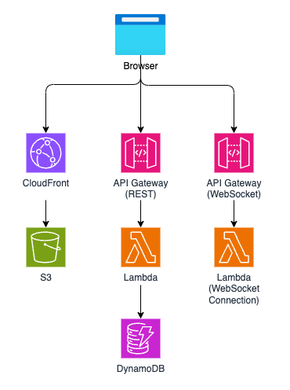

# Healthcare Document Analysis System with Amazon Bedrock Integration

A serverless application that provides real-time document analysis and intelligent responses using Amazon Bedrock's language models. The system processes various document types (PDF, text) and provides streaming responses through WebSocket connections for enhanced user experience.

This solution combines modern web technologies with AWS serverless architecture to deliver a robust document analysis platform. It leverages Amazon Bedrock's powerful language models for comprehensive document analysis and intelligent response generation. The system supports real-time streaming responses through WebSocket connections, making it ideal for processing large documents and providing immediate feedback to users.

## Usage Instructions
### Prerequisites
- AWS Account with appropriate permissions
- AWS CLI installed and configured
- Node.js 14.x or later
- Python 3.9 or later
- AWS SAM CLI installed
- Access to Amazon Bedrock service

### Installation

#### Backend Deployment
1. Clone the repository
```bash
git clone <repository-url>
cd <repository-name>/backend
```

2. Deploy the backend infrastructure
```bash
./deploy.sh <stack-name> <s3-bucket-name>
```

#### Frontend Setup
1. Install dependencies
```bash
cd frontend
npm install
```

2. Configure environment variables
```bash
cp .env.example .env
# Edit .env with your API endpoints
REACT_APP_API_ENDPOINT=<REPLACE WITH API Gateway REST URL>
REACT_APP_WS_ENDPOINT=<REPLACE WITH API Gateway Web Socket URL>
REACT_APP_APIGATEWAY_STAGE=<REPLACE WITH STAGE NAME>

```


3. Start the development server
```bash
npm start
```

### Quick Start
1. Access the web application at `http://localhost:3000`
2. Upload a document (PDF or text) using the file upload interface
3. Select or enter an analysis prompt
4. View real-time analysis results through the WebSocket connection

## Data Flow
The system processes documents through a multi-stage pipeline, from initial upload through analysis to real-time response streaming via WebSocket connections.

```ascii
Client ─► API Gateway ─► Lambda ─► Bedrock
  ▲           │            │         │
  │           │            │         │
  └───────────┴────────────┴─────────┘
     WebSocket Response Stream
```

Component Interactions:
1. Client uploads document through REST API
2. API Gateway routes request to appropriate Lambda function
3. Lambda function initiates document processing with Bedrock
4. Results stream back through WebSocket connection
5. DynamoDB stores connection IDs and prompts
6. S3 stores temporary document artifacts
7. WebSocket maintains real-time communication

## Infrastructure



### Lambda Functions
- `GenerateTextResponseFunction`: Generates text responses using Bedrock models
- `BedrockImageProcessFunction`: Processes images using Bedrock
- `WebSocketConnectionFunction`: Manages WebSocket connections
- `ManagePromptsFunction`: Handles prompt management

### Storage
- `HealthcareDemosBucket`: S3 bucket for document storage
- `PromptsTable`: DynamoDB table for storing analysis prompts
- `ConnectionsTable`: DynamoDB table for WebSocket connections

### API Gateway
- `WebSocketAPI`: WebSocket API for real-time communication
- `DemoAPIGateway`: REST API for document processing endpoints

## Deployment

### Prerequisites
- AWS SAM CLI installed
- AWS credentials configured
- S3 bucket for deployment artifacts

### Deployment Steps
1. Build the application
```bash
sam build
```

2. Deploy the infrastructure
```bash
sam deploy --guided
```

3. Configure environment variables
```bash
aws ssm put-parameter --name /healthcare-demo/api-url --value <api-url>
```

4. Monitor deployment
```bash
aws cloudformation describe-stacks --stack-name <stack-name>
```